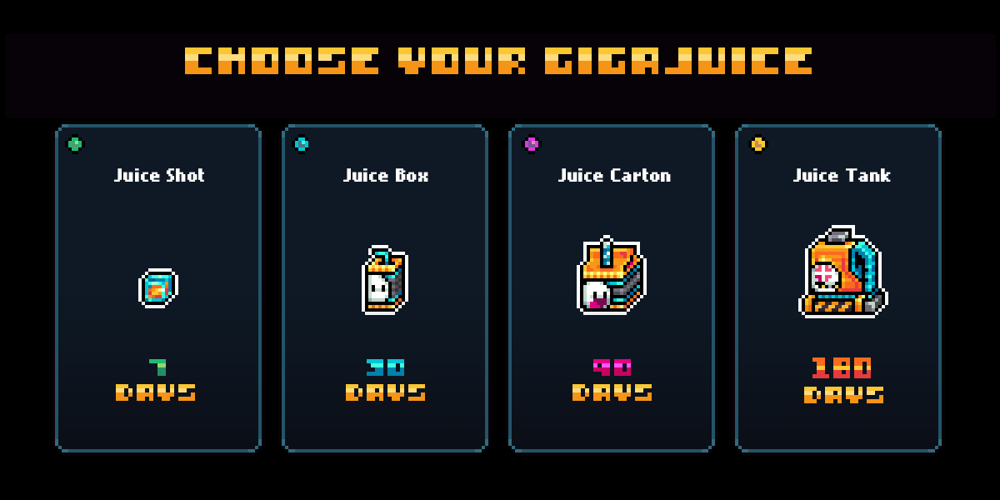

# Abstract Badge: Giga Juicy

<mark style="color:$warning;">LIMITED TIME BADGE - NO LONGER POSSIBLE TO ACQUIRE.</mark>

<figure><figcaption>
Giga Juicy Flash Badge claim on Abstract Portal
</figcaption></figure>


"Giga Juicy" was a flash badge for a limited time only, from 1st May 2025 till 6th May 2025.


***

#### Step-by-step guide  :arrow\_down:&#x20;

**STEP 1:** Go to [gigaverse.io](https://gigaverse.io/), click the {Connect} button and sign in with Abstract Global Wallet (AGW).

**STEP 2:** Enter a username and click on {Claim Noob 0.005 ETH}.&#x20;


#### you must have 0.005 ETH in your wallet in order to mint your noob and enter the game. If you need to bridge funds to your Abstract wallet, you can use the [Abstract Portal](https://portal.abs.xyz/profile) to do so.


**STEP 3:** Once you've minted your noob, you can spawn in to the game. Once you've spawned, approach the vending machine just above you, and press E to bring up the menu.&#x20;

<figure><figcaption>
Approach the vending machine and press E
</figcaption></figure>

**STEP 4:** Via the popup menu, select any duration of Giga Juice you want, then complete your purchase by clicking on the "Get Juiced" button and completing the transaction in your AGW popup.

<figure><figcaption>
Longer lasting juice is more economical per month
</figcaption></figure>

\
**STEP 5**: Head over to the rewards section on Abstract to claim the flash badge. 


That's it! Soon after your purchase is complete, you'll be granted the Juice Drinker badge on Abstract


<table data-header-hidden data-full-width="true"><thead><tr><th></th><th></th><th data-hidden></th></tr></thead><tbody><tr><td></td><td></td><td></td></tr></tbody></table>
