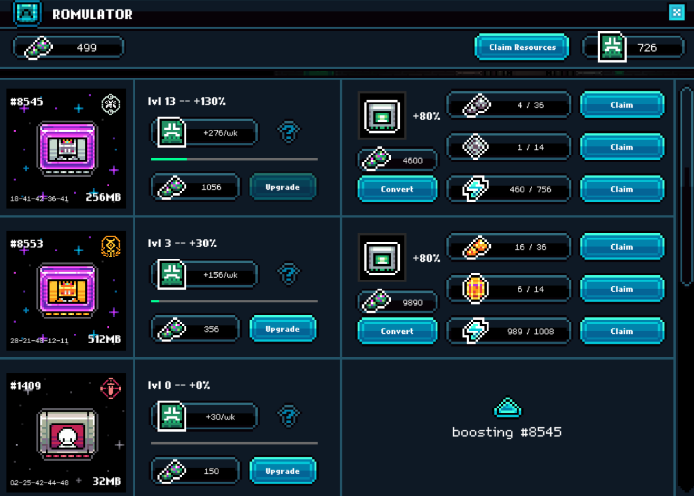
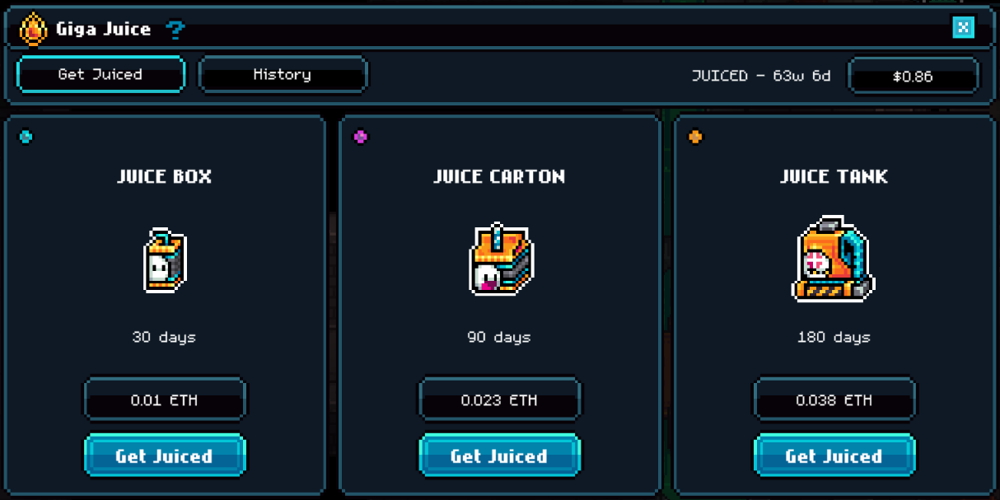

# Abstract Stubs

Abstract Stubs is the points system to calculate an Abstract users weekly Abstract XP share for specific activities in the Gigaverse

Weeks start Friday at 6pm UTC (reset time) and end the following Friday at reset.

Collected Abs Stubs are burned Friday, and applied to the following Tuesday’s Abstract XP drop ([abs.xyz/rewards](https://abs.xyz/rewards))


Compete for weekly Abstract XP by collecting Stubs


Players can earn Stubs in the following ways

* Trade in items with the Traveling Merchant [hugis-and-munis.md](../hugis-and-munis.md "mention"); two types of trade deals - Weekly & Daily
* Hold [gigaverse-roms.md](../nft-collections/gigaverse-roms.md "mention")
* Buy [Broken link](/broken/pages/rNyf8TiTC6ZzUDTiXZSz "mention") to get 4x more stubs per deal when trading Hugis


There may be more ways to earn Stubs in the future


***

### Traveling Merchant [hugis-and-munis.md](../hugis-and-munis.md "mention")

The traveling merchant offers Daily & Weekly trade deals, where you can trade in items to receive Abstract Stubs in exchange.

Each deal has a maximum turn in amount.


Example: 0/4 means you can do that specific deal 4 times that day or week


<figure><figcaption>
Traveling Merchant UI
</figcaption></figure>

### Gigaverse ROMs [gigaverse-roms.md](../nft-collections/gigaverse-roms.md "mention")

ROM holders passively earn Stubs every week.

They are claimed automatically and will reflect in your Abstract XP&#x20;


Stubs produced by ROMs do not effect/show up in the Stubs Leaderboard


ROMs can be upgraded from Level 1-60 to increase passive Stubs generation. Learn more in [Gigaverse ROMs](https://glhfers.gitbook.io/gigaverse/nft-collections/gigaverse-roms)


Must be holding Gigaverse ROM(s) at the time of the weekly snapshot


<figure><figcaption>
Gigaverse ROM UI
</figcaption></figure>

### Giga Juice [how-to-buy-giga-juice.md](../giga-juice/how-to-buy-giga-juice.md "mention")

Giga Juice provides benefits to those looking to increase their weekly Abstract Stubs:&#x20;

-Receive 4x stubs for deals you make with Hugis

-More energy and more dungeon runs to earn items + more fishing casts

<figure><figcaption>
Giga Juice is available at the Juice Vending Machine where you spawn
</figcaption></figure>

<table data-header-hidden data-full-width="true"><thead><tr><th></th><th></th><th data-hidden></th></tr></thead><tbody><tr><td></td><td></td><td></td></tr></tbody></table>
