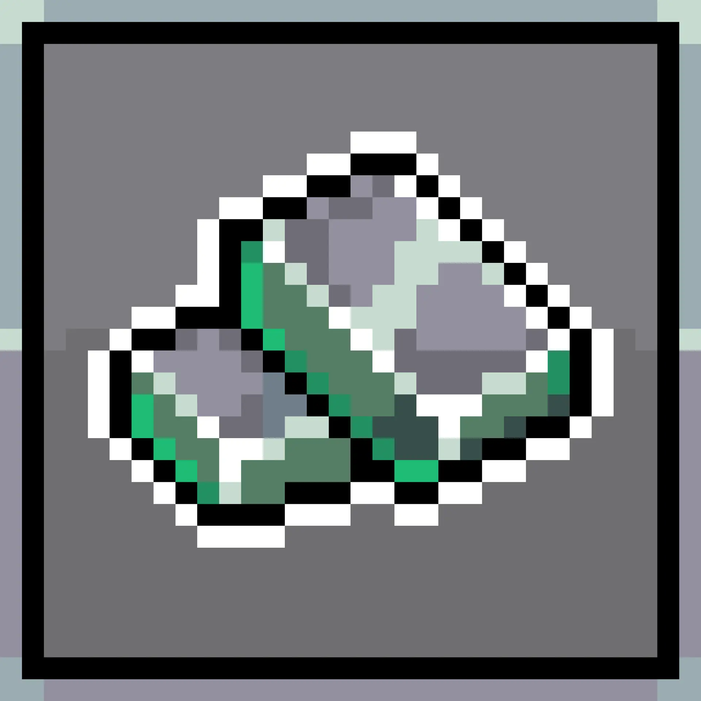

# Materials (eg 1)

### General materials

Dropped in dungeons

<table data-full-width="true"><thead><tr><th width="197.00000000000006">Material</th><th width="112">Icon</th><th width="119">Rarity</th><th width="121">Token Type</th><th>Description</th><th data-hidden data-type="files"></th></tr></thead><tbody><tr><td>Dungeon Scrap</td><td></td><td>Common</td><td>Soulbound</td><td>A valuable material found commonly within the dungeon. Used to level up Dungetron skills and various crafts.</td><td><a href="../.gitbook/assets/bafkreie5zmgo7sbrxhvbssjgcotvynneix4snqllohnu44y77bszo5nnre.webp">bafkreie5zmgo7sbrxhvbssjgcotvynneix4snqllohnu44y77bszo5nnre.webp</a></td></tr><tr><td>Bolt</td><td></td><td><mark style="color:green;">Uncommon</mark></td><td>ERC1155</td><td>A small bolt used for putting things together.</td><td></td></tr><tr><td>Steel Pipe</td><td></td><td><mark style="color:green;">Uncommon</mark></td><td>ERC1155</td><td>A heavy steel pipe.</td><td></td></tr><tr><td>Void Seed</td><td></td><td><mark style="color:blue;">Rare</mark></td><td>ERC1155</td><td>Soft purple seeds. Plants seldom grow in the depths of the dungeon, so where did these come from?</td><td></td></tr><tr><td></td><td></td><td></td><td></td><td></td><td></td></tr></tbody></table>

### Faction materials

Claim via ROMs

<table data-full-width="true"><thead><tr><th width="197.00000000000006">Material</th><th width="112">Icon</th><th width="119">Rarity</th><th width="121">Token Type</th><th>Description</th><th data-hidden data-type="files"></th></tr></thead><tbody><tr><td>Crusader Dust</td><td></td><td><mark style="color:green;">Uncommon</mark></td><td>ERC1155</td><td>Glistening pink dust.</td><td></td></tr><tr><td>...</td><td></td><td></td><td></td><td></td><td></td></tr><tr><td>...</td><td></td><td></td><td></td><td></td><td></td></tr><tr><td></td><td></td><td></td><td></td><td></td><td></td></tr></tbody></table>

