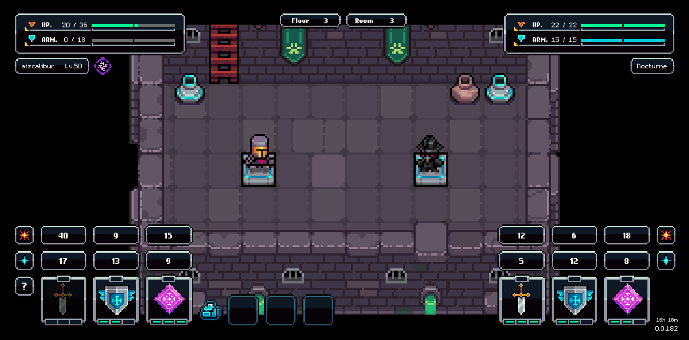

# Dungetron 5000: Normal

<figure><figcaption></figcaption></figure>

### Combat Mechanic

At present, both you and your opponent have one of three available moves (Sword / Shield / Spell) to cast against each other. Each move counters another. Sword counters Spell, Spell counters Shield, and Shield counters Sword. Should your move beat that of your enemy, you will deal damage to them, as well as potentially repair your shield.

### Entry Requirement

 40 energy must be spent to enter the dungeon.

### Rewards

By defeating enemies you will earn dungeon scrap (a soulbound item — meaning it can't be traded) that can be used to upgrade your skills, allowing you to become stronger and progress further in combat over time.&#x20;

In addition to scrap, random rewards (in the form of items, materials, and skins) will drop when you defeat each enemy. These rewards increase in size & rarity as you progress through the dungeon.

### Daily Limit

10 runs per day (12 if juiced), subject to change

### Flee

You are able to flee the dungeon (end your run without dying, and keep any unused potions)

To Flee, approach the ladder and exit once you've defeated an enemy, and before progressing to the next room.

If you die, you will drop unused potions, but keep any loot you’ve obtained along the way.

### Consumables

You can craft or purchase [consumables.md](../../crafting-and-stations/alchemy-bench/consumables.md "mention") to take into the dungeon with you.&#x20;

<table data-header-hidden data-full-width="true"><thead><tr><th></th><th></th><th data-hidden></th></tr></thead><tbody><tr><td></td><td></td><td></td></tr></tbody></table>
