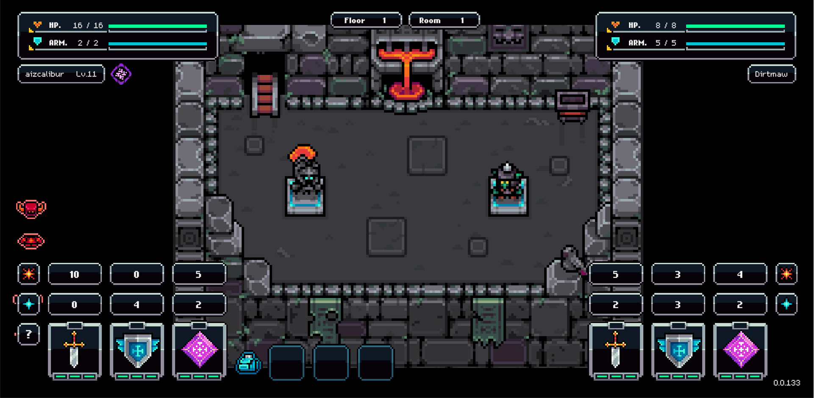

# Dungetron: Underhaul

<figure><figcaption></figcaption></figure>

### Combat Mechanic

Combat works in the same way as any other dungeon.&#x20;

### Entry Requirement

 40 energy must be spent to enter the Underhaul dungeon.

 150 Giga Shards (One-time unlock fee)&#x20;

### Rewards

By defeating enemies you will earn gigashards (a soulbound item — meaning it can't be traded) that can be used to upgrade your skills, allowing you to become stronger and progress further in combat over time.&#x20;

In addition, random rewards (in the form of items, materials, and skins) will drop when you defeat each enemy. These rewards increase in size & rarity as you progress through the dungeon.

### Daily Limit

9 runs per day (12 if Juiced), subject to change.

### Flee

You are able to flee the dungeon (end your run without dying, and keep any unused potions) by approaching the ladder once you've defeated an enemy, and before progressing to the next room.

### Consumables

You can craft or purchase consumables to take into the dungeon with you.

<table data-header-hidden data-full-width="true"><thead><tr><th></th><th></th><th data-hidden></th></tr></thead><tbody><tr><td></td><td></td><td></td></tr></tbody></table>
