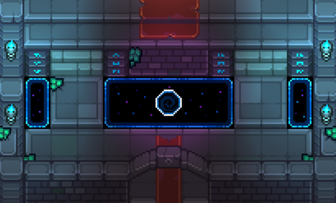
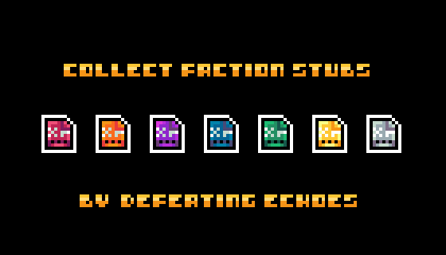

# Conquest Overview

<figure><figcaption></figcaption></figure>

Conquest is a social, team based pvp game mode.\
\
Conquest's map, event structure, and game mechanics can change from one Conquest to the next

### Objective

Coordinate with your Faction to capture & hold as much territory as you can within the Conquest map

### Requirement

Players need Faction Stubs to play Conquest.&#x20;

These are dropped by [echo-battles.md](../combat/echo-battles.md "mention") and by catching Fish. There may be more ways to get Faction Stubs in the future.

Each Echo drops both player and Echo Faction Stubs, once defeated.

<figure><figcaption></figcaption></figure>

### Gameplay

1. Use your own Faction Stubs to increase your control of a territory
2. Use opposing Faction Stubs to decrease their control of a territory


Faction Stubs are burned when used; be strategic.


### Crowns

Crowns are conquest rewards based on both individual contribution within a faction and the faction's performance relative to others

* Calculated as follows:
  * Crowns = Individual Contribution X Faction Rank
  * Contribution = Player Stub Score / Total Faction Stub Score
  * Faction Rank = 100x (last place) up to 700x (first place)
* Stub score is the stubs you place on the map
* Stub score starts at 0 for each faction as you switch. If you switch back, it picks up from where you left off.
* Crown Leaderboard shows both global rank & faction rank (similar to abstract stubs leaderboard system)
* Ranks can be seen in real-time (immediate past round)

<figure><figcaption>
Crowns Leaderboard
</figcaption></figure>


When Conquest ends, only your contributions to your current faction will count

