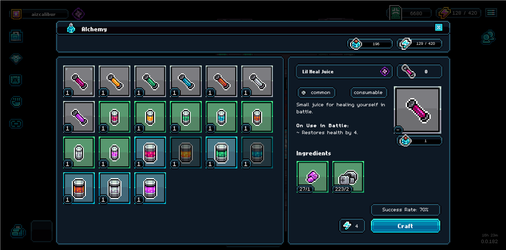

# Consumables

Consumables are one-time use potions that can be used in combat to help you progress further in the dungeon. They can be crafted at the Alchemy Bench, or purchased on the gigamarket. \
\
Consumables require faction-specific ingredients that are only produced by ROMs with those faction traits. So if you wish to craft all the various different consumables, it is beneficial to hold ROMs of each different faction type.&#x20;

<figure><figcaption>
Alchemy Bench UI
</figcaption></figure>

### How does your faction affect recipe requirements?

Depending on the faction you chose when you entered Gigaverse ([factions.md](../../factions/factions.md "mention")) you will have different material requirements for crafting consumables. This is by design.

<figure><figcaption>
Faction Recipes
</figcaption></figure>

<table data-header-hidden data-full-width="true"><thead><tr><th></th><th></th><th data-hidden></th></tr></thead><tbody><tr><td></td><td></td><td></td></tr></tbody></table>

