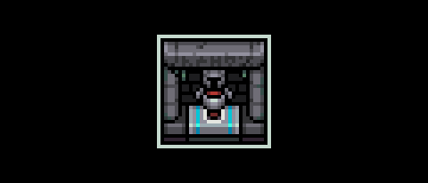
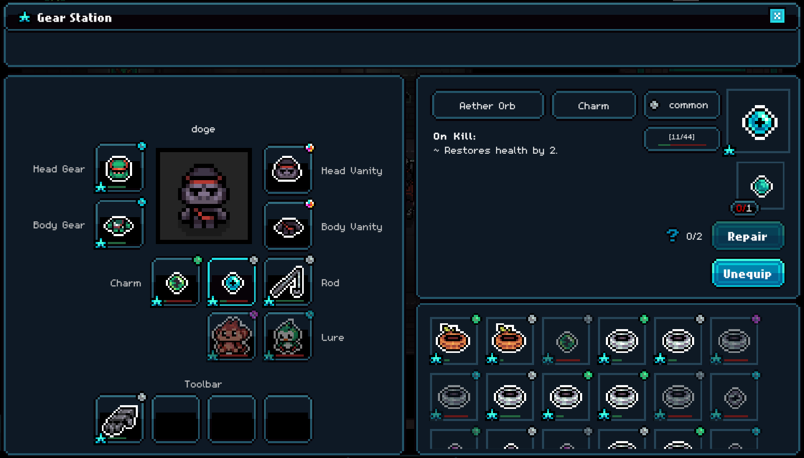

# Gear Station

<figure><figcaption>
Gear Station
</figcaption></figure>

### Where it is

The Gear Station can be found beside the stairway to the Dungetron.

### What it does

**Equip Gear**: Players can equip gear they've crafted at the [workbench](workbench/ "mention").

**Repair Gear**: Players can restore gear durability. After all repairs are used, an additional cost will be required to reset repairs.

<figure><figcaption>
Gear Station UI
</figcaption></figure>

Note: it is possible to equip both gear (which has stats) and skins (for vanity purposes). If no skins are equipped, your character's look will be based off the gear that is equipped. If you equip skins, the look of the skins will override the look of the gear.&#x20;

<table data-header-hidden data-full-width="true"><thead><tr><th></th><th></th><th data-hidden></th></tr></thead><tbody><tr><td></td><td></td><td></td></tr></tbody></table>
