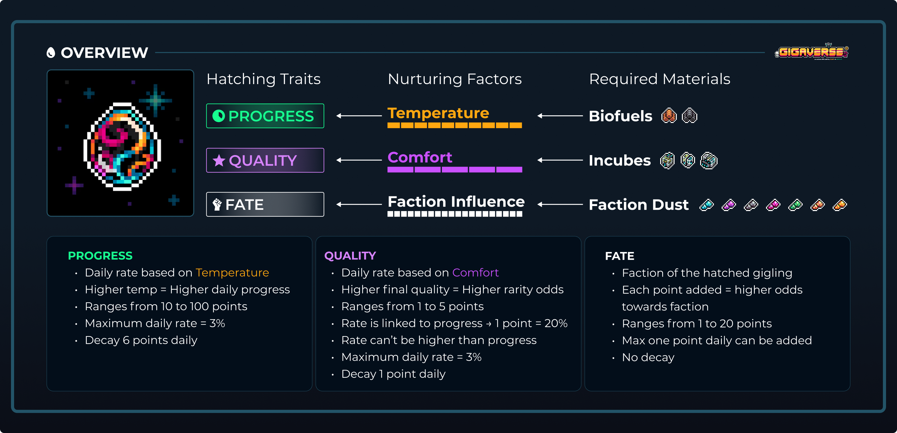
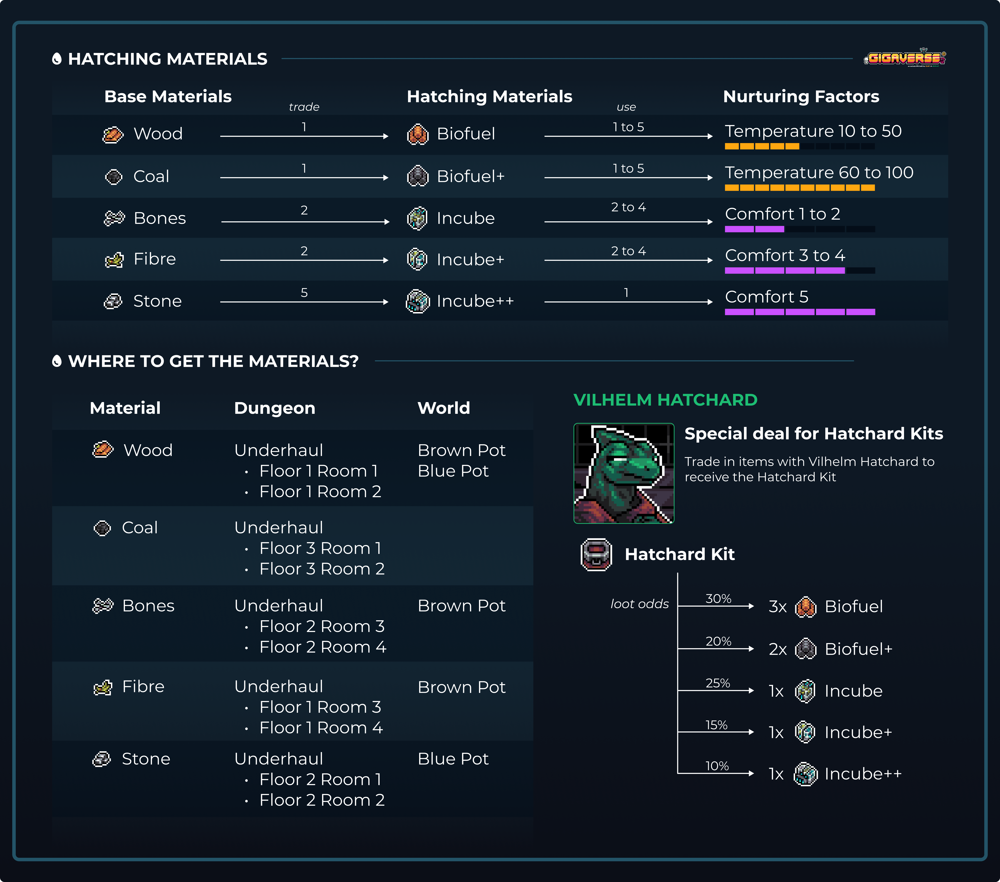
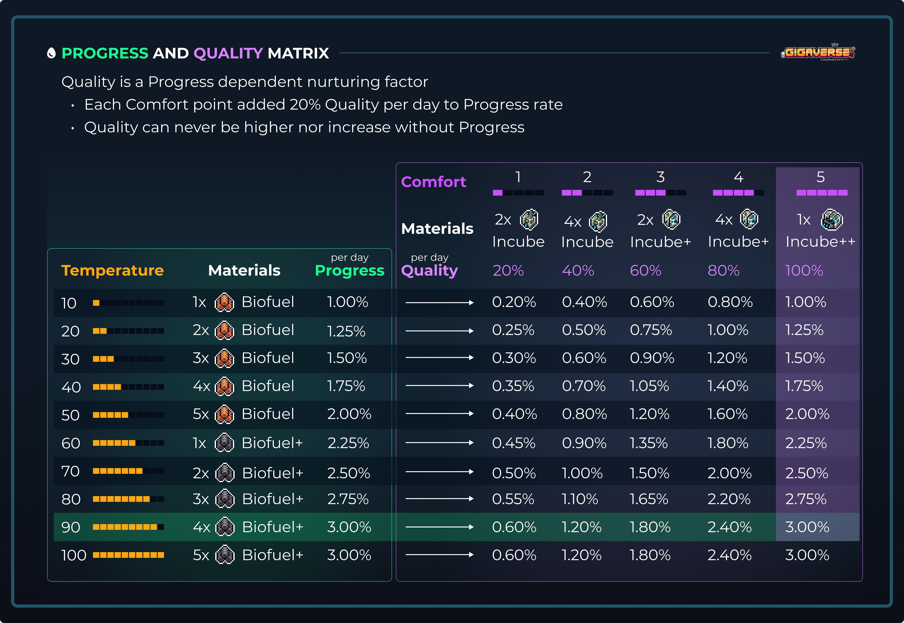

# Hatchery

The hatchery station is where players hatch their [gigaverse-giglings.md](../nft-collections/gigaverse-giglings.md "mention") Eggs.

<figure><figcaption></figcaption></figure>

### Where it is

The Hatchery can be found in the underground room beside the fishing pond.

### What it does

The Hatchery allows you to hatch your gigling eggs through a resource and time-intensive process.&#x20;

### Hatching Process

Egg hatching is a delicate process and to achieve the best possible outcome (a high-quality hatch at the fastest speed), you'll need to maximize the temperature AND the comfort of each egg.

<figure><figcaption></figcaption></figure>

Multiple eggs can be hatched at once, but make sure you have enough materials to sustain their comfort and temperature all throughout the hatching process!

Feeding eggs with different faction resources influences the faction that the gigling will belong to, when hatched.&#x20;

### Resource Requirements

Hatching an egg requires hatching materials and faction dust (optional).

Two types of hatching materials - Biofuels and Incube. All of the materials are soul-bound to the player.

They can be acquired by trading base materials that can be found in the dungeon.

<figure><figcaption></figcaption></figure>

### Faction Specific Resource Requirements

Faction dust can be added to the hatching process to provide the pet faction affinity.&#x20;

Each input of Faction dust increases the Fate by 4.75% for that Faction + 0.25% of Gigus Faction . Multiple can be used.

Started from 5 Dust up to 25 Dust for a total of 20x influence, providng 95% Faction chance and 5% Gigus Faction chance.

<figure><figcaption></figcaption></figure>

### Progress (Temperature) AND Quality (Comfort)

Progress is directly influenced by the Temperature while Quality is influenced by both Comfort and Progress.

Check the following matrix to understand the relation between the factors.&#x20;

<figure><figcaption></figcaption></figure>
