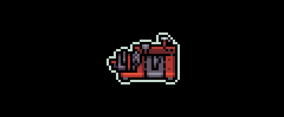

# Workbench

<figure><figcaption>
Workbench
</figcaption></figure>

### Where it is

The Workbench can be found in the middle of the map

### What it does

The Workbench allows you to craft [Gear](https://glhfers.gitbook.io/gigaverse/crafting-and-stations/workbench/gear).&#x20;

Gear fills a variety of roles in the gigaverse.

### Resource Requirements

Each piece of gear requires different resources.

### XP Requirements

Some starter gear requires Alchemy XP to craft (earned by crafting Consumables at the Alchemy Bench)

Mid-tier and High-tier gear requires Workbench XP to craft (earned by crafting Charms, Mid-tier Gear, and High-Tier Gear)


Hint: You can see the Workbench or Alchemy XP reward per craft on the middle right, while the XP cost to craft will be under the ingredients cost


### Faction Specific Resource Requirements

Most gear does not require faction specific resources to craft. If it does, you will see this under the list of required ingredients.&#x20;

### Success Rate

Crafting gear currently has a 100% chance of success. Future gear crafts may have a chance of failure.

<table data-header-hidden data-full-width="true"><thead><tr><th></th><th></th><th data-hidden></th></tr></thead><tbody><tr><td></td><td></td><td></td></tr></tbody></table>
