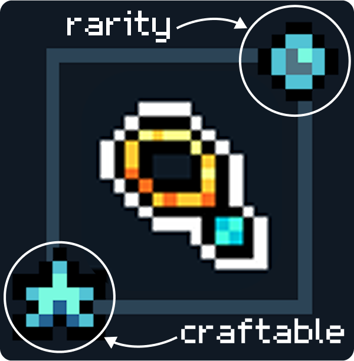

# Charms

<figure><figcaption></figcaption></figure>

Charms can be crafted at the [.](./ "mention"), and equipped at the [gear-station.md](../gear-station.md "mention").&#x20;

Charms have different roles and bonuses. Orbs & Necklaces can be crafted into Charms which have special effects, giving you an advantage in combat.

### Rarity

Higher rarity Charms have better durability and may have stronger effects

Charms get a random rarity upon craft, based on the odds below:

 (50%) Common&#x20;

 (30%) Uncommon&#x20;

 (15%) Rare&#x20;

 (5%) Epic&#x20;

### Durability

Charms degrade with each Dungetron run until their durability is 0. Once broken, charm effects no longer work. They must be repaired using resources at the Gear Station to begin functioning again.

### Repairs

You can repair Charms at the [gear-station.md](../gear-station.md "mention") for a cost.&#x20;


WARNING: Current Charms can only be repaired two times before permanently breaking. They cannot be restored like head & body gear.


<table data-header-hidden data-full-width="true"><thead><tr><th></th><th></th><th data-hidden></th></tr></thead><tbody><tr><td></td><td></td><td></td></tr></tbody></table>
