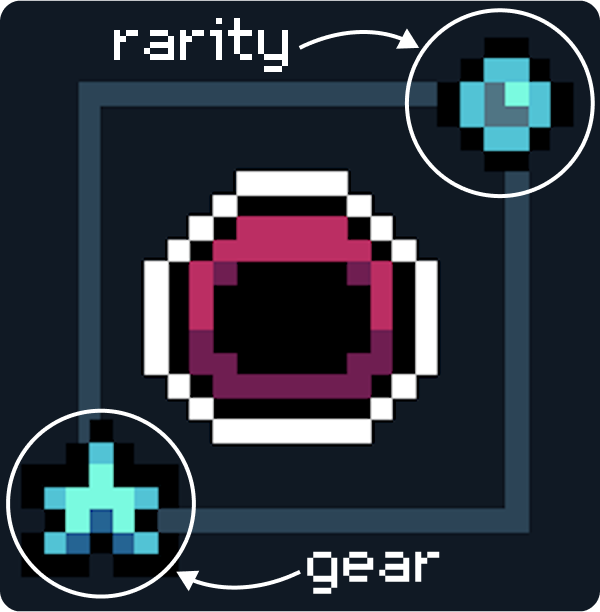

# Gear

<figure><figcaption></figcaption></figure>

Gear is a system of equipment.

There are many types of Gear (Head, Body, Charms, Hands, Lures, Rods)

Vanity skins can be crafted into Gear at the [.](./ "mention"), and equipped at the [gear-station.md](../gear-station.md "mention").&#x20;

Each piece of Gear plays a different role and provides different utility. Head skins & body skins can be turned in to head gear & body gear which has stat points, giving you an advantage in combat.&#x20;


Gear cannot be traded once crafted, only vanity (cosmetic skins) can


### Rarity

Gear exists in different levels. Higher rarity gear has increased stat points and/or more durability.

Upon Crafting and Restoring Gear, you have a % chance of rolling common, uncommon, rare, or epic gear:

 (50%) Common&#x20;

 (30%) Uncommon&#x20;

 (15%) Rare&#x20;

 (5%) Epic&#x20;

You can preview the stats of each rarity tier in the [.](./ "mention")by clicking on a piece of gear and clicking the rarity circle with the percentages next to it.

### Durability

Gear degrades with use, until it breaks. Once broken, its stats / utility no longer work. It must be repaired using resources to restore it to its full capability.

### Repairs

You can repair gear at the [gear-station.md](../gear-station.md "mention") for a cost.


To find the cost, go to the Gear Station, select a piece of gear, and above the “Repair” button you will see the cost.


\
Repair Limit: Each piece of Gear has a repair limit.

Example: Head and Body gear can be repaired 5 times, you will see a 0/5 upon first craft, moving up by 1 with each repair.

Once a repair limit is reached, the gear will no longer function and/or give stats.

### Restoration

Some Gear, like Head & Body Gear, can be “Restored” with Gear Ember.

Restoring Gear resets the repair limit to 0 so you can repair it again.

Restoring Gear also re-rolls the rarity of that Gear.


[Charms](https://glhfers.gitbook.io/gigaverse/crafting-and-stations/workbench/charm), [Hands](https://glhfers.gitbook.io/gigaverse/world-environment/pots), [Lures](https://glhfers.gitbook.io/gigaverse/fishing/fishing-equipment), and [Rods](https://glhfers.gitbook.io/gigaverse/fishing/fishing-equipment) cannot be restored, only repaired to a max limit


#### Gear Ember

Gear Ember used in Restoration comes from burning Head and Body Gear at the [gear-station.md](../gear-station.md "mention").  

The more advanced gear, typically from deeper levels of the dungeon, will cost more Gear Ember to restore, but grant more Gear Ember when burned.

<table data-header-hidden data-full-width="true"><thead><tr><th></th><th></th><th data-hidden></th></tr></thead><tbody><tr><td></td><td></td><td></td></tr></tbody></table>
