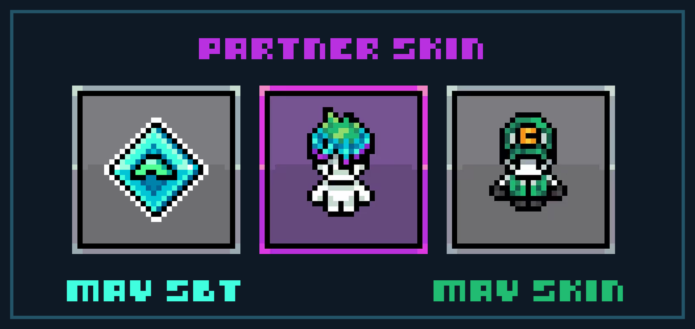

# Giga Creators Program

The Giga Creators Program is designed to support and reward individuals who create original content about Gigaverse.&#x20;


Gigaverse is a newly launched game and as such, we are constantly updating this program based on feedback and experience. We encourage all creators (whether you participate in the Program or not) to share your feedback with us as we look to improve the Program continuously over time!


### Who can join

Anyone passionate about Gigaverse who creates content in various formats, including:

* **Gameplay Videos** (Walkthroughs, Let's Plays, Reviews, etc.)
* **Guides & Tutorials** (Beginner’s Guide, Crafting, PVP Strategies, etc.)
* **Educational Content** (Blockchain gaming, On-chain economy in Gigaverse, etc.)
* **Information & News** (Updates, Patch Notes, Event Coverage, etc.)
* **Graphics** (Fan Art, GIFs, Comics, Infographics, etc)
* **Memes (All media types)**

***

### Requirements

* Content must be original and Gigaverse exclusive (Not 3rd party apps/tools unless official partners).
* Must be posted on social media (Twitter, TikTok, YouTube, Instagram, etc.).
* If you wish to get engagement on content published outside X, then the link must be posted on X, tagging our official account - @playgigaverse.
* Maintain a consistent posting schedule (2 quality pieces minimum per month).
* Vote on peer content each month..

***

### Evaluation Metrics

Creators will be assessed based on:

* **Relevance** (Gigaverse only content)
* **Quality** (Originality, Insightfulness, Call To Action, Uniqueness)
* **Engagement** (Likes, Reshares and Meaningful Comments)
* **Reach** (Views / Impressions to engagement ratio)&#x20;
* **Consistency** (No. of relevant content per week/month)

***

### Rewards

Rewards have been designed for creators that meet the criteria on a monthly basis. The following system is designed to motivate consistent output with fun surprises

#### :medal: Rewards

**All qualifying content receive:**

* GigaUtility Bag: Consumables, gear or crafting materials
* GigaFlex Bag: Guaranteed 1x Unique Cosmetic only for official creators
* Giga Creator SBT: 1x unique SBT every month used to track, reward, allocate, etc. in the future
* Partnership IP skin: Contingent on Content around the partner & IP
* Engagement via official social media account on X & other platform where possible
* Special role & exclusive channel on Discord (with WL raffle boost)
* Monthly creators’ roundup thread

**Top \~40% quality content, as voted by other Giga Creators (peer voting system) receive:**

* $50 USDC each

<figure><figcaption>
May 2025 Rewards
</figcaption></figure>

#### :medal: Quarterly Rewards (every 3 months)

**All consistent & qualifying creators with SBT tier 3, 6, etc. receive:**

* ETHOS review & Twitter spotlight&#x20;
* Opportunity to level up to Ambassadorship&#x20;

**Top 2 performing creators receive:**&#x20;

* 1x GLHFer
* 1x ROM NFT
* 1x ETHOS vouch

***

### How to apply

Reach out to Aiz (X [@Aizcalibur](https://x.com/Aizcalibur)) to receive the GigaCreators Application Form

***

Empowering Creators, Amplifying the Gigaverse Experience!

Let’s build Gigaverse together, one pixel at a time!&#x20;

<table data-header-hidden data-full-width="true"><thead><tr><th></th><th></th><th data-hidden></th></tr></thead><tbody><tr><td></td><td></td><td></td></tr></tbody></table>
