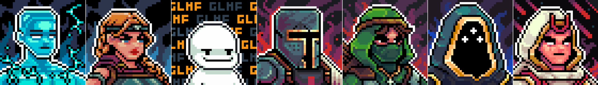

# Factions

There are 8 factions in gigaverse:&#x20;

  Archon

.png>)  Athena

  Chobo

  Crusader

  Foxglove

  Overseer

  Summoner

.png>)  Gigus

\
These factions relate to the 7 Masters of the Gigaverse (Special Characters in the [glhfers.md](../nft-collections/glhfers.md "mention")collection), and to Gigus, the sentient AI creator of Gigaverse.

<figure><figcaption>
Archon, Athena, Chobo, Crusader, Foxglove, Overseer, and Summoner
</figcaption></figure>

When starting the game, align with one of the factions belonging to the 7 “Masters of the Gigaverse”.&#x20;

Your choice may impact certain aspects of the game, such as the resources you require to craft [consumables](https://glhfers.gitbook.io/gigaverse/crafting-and-stations/alchemy-bench/consumables) or which [Faction Leaderboard](https://glhfers.gitbook.io/gigaverse/in-game-trading/traveling-merchants) you are competing on

You can change your in-game faction via [Faction Altar Room](https://glhfers.gitbook.io/gigaverse/factions/faction-altar-room) using in-game materials.&#x20;

More details about factions and their role within the future of Gigaverse shall be revealed over time.

<table data-header-hidden data-full-width="true"><thead><tr><th></th><th></th><th data-hidden></th></tr></thead><tbody><tr><td></td><td></td><td></td></tr></tbody></table>
