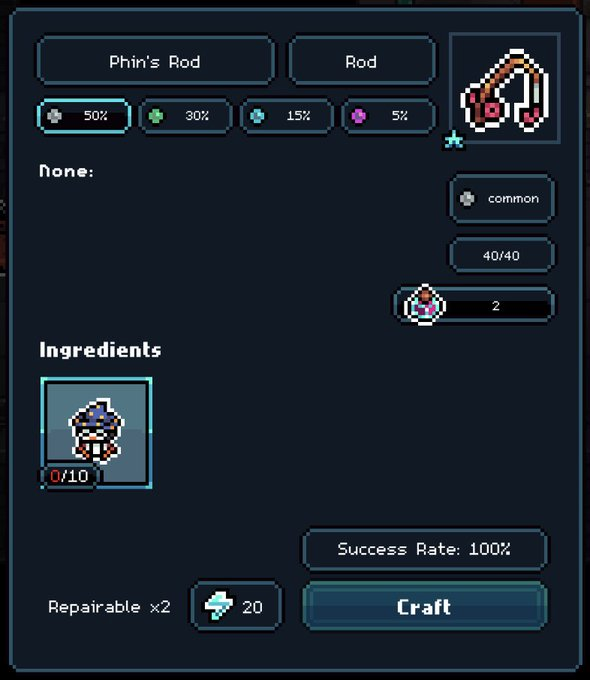

# Fishing Equipment

### Fishing Rods

Fishing Rods are equipment that provide a starting spell deck depending on the type and rarity.

<figure><figcaption></figcaption></figure>

#### Types Of Rods

Currently, there are three Rods you can craft&#x20;

* Wood (<mark style="color:$info;">Common</mark>) - Repairable 1 time
* Stone (<mark style="color:green;">Uncommon</mark>) - Repairable 1 time
* Phin's Rod (<mark style="color:purple;">Epic</mark>) - Repairable 2 times

#### Crafting

You can craft Fishing Rods in the [workbench](../crafting-and-stations/workbench/ "mention") with the required materials, obtained from Dungeons, Pots or [gigamarket.md](../in-game-trading/gigamarket.md "mention")

### Lures

Lures are equipment that provide bonuses to fishing skills

Currently, there are two types of lures:

* Pengu Lure: Increases your chance of triggering Dual Yielding upon catching a fish (2x fish)
* Chimpu Lure: Increases your chance of triggering Jebait upon casting and Fintuition upon playing spells

<figure><figcaption></figcaption></figure>

<figure><figcaption></figcaption></figure>

<table data-header-hidden data-full-width="true"><thead><tr><th></th><th></th><th data-hidden></th></tr></thead><tbody><tr><td></td><td></td><td></td></tr></tbody></table>
