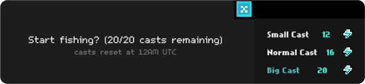

# Fishing Overview

<figure><figcaption>
Fishing area
</figcaption></figure>

FIshing is a new game mode in Gigaverse. You play spells (cards) from your deck to hit and catch fish. Every successful catch results in an additional spell added to your deck for the day. \
\
Here's a [community-made video guide](https://x.com/web3_shadowking/status/1934699216301179283) on how fishing works.&#x20;

### Fishing Mechanic

The fishing area is a 3x3 grid. Fish swim to a different cell each turn, after you play a spell card.&#x20;

Spells (cards) have mana costs, hit locations, and damage indicators. Click the card with hit boxes that you predict the fish will travel to on the next turn. Successful “hits” will increase the catch meter, while a “miss” will decrease it. Fill the catch meter to catch a fish.&#x20;


Hint: Fish have a variety of different patterns, use the first move to note the pattern.


You can also redraw your hand instead of casting a spell, which costs 1 mana per card left in your current hand. If you are out of mana before the catch meter fills, or the catch meter goes to zero, the fish escapes and your cast ends. 

<figure><figcaption></figcaption></figure>

### Entry Requirement

There are three levels of cast requiring scaling energy:

Small Cast  12 energy&#x20;

Normal Cast  16 energy&#x20;

Big Cast  20 energy&#x20;

<figure><figcaption></figcaption></figure>

### Fishing Equipment

You can equip Fishing Rods that provide a set of starting spells depending on the Rod type and rarity.

<figure><figcaption></figcaption></figure>

### Rewards

You can catch different types of fish having unique stats and rarities:

:1234: Stats: Weight (WGT), Length (LNG) and Girth (GRT)

<figure><figcaption></figcaption></figure>

:star: Rarity: Common, Uncommon, Rare, Epic, Legendary, Relic, Giga

Higher Rarity fish are worth more Seaweed at [Tonno](https://glhfers.gitbook.io/gigaverse/fishing/fish-stall), the Fishing Vendor.

<figure><figcaption></figcaption></figure>

### Daily Limit

Normal: 10 casts per day&#x20;

Juiced Player: 20 casts per day


This is subject to change in the future


<table data-header-hidden data-full-width="true"><thead><tr><th></th><th></th><th data-hidden></th></tr></thead><tbody><tr><td></td><td></td><td></td></tr></tbody></table>
