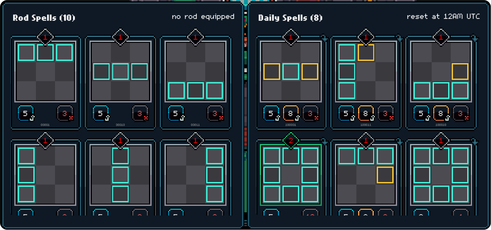

# Fishing Spells

<figure><figcaption>
Spell (card) breakdown
</figcaption></figure>

Spells (cards) are used to catch fish.

You receive a random deck daily and you can collect more Spells as you successfully catch fish.

Each card has three main elements: Mana, Hit boxes & Hit multiplier

### Mana

Indicates the amount of Mana required to play the card.

### Hit Boxes

Indicate which space you predict the fish will move to next turn &#x20;

<mark style="color:blue;">Blue</mark> indicators are normal hits.

<mark style="color:yellow;">Yellow</mark> indicators are critical hits.

<mark style="color:red;">Red</mark><mark style="color:$info;">/</mark><mark style="color:$info;">Grey</mark> indicators are miss.

### Hit Multipliers

Each number within the bottom boxes indicates the hit amount.&#x20;

The hit and miss square values will increase or decrease the catch meter by that amount depending on where the fish lands.

<figure><figcaption></figcaption></figure>

<table data-header-hidden data-full-width="true"><thead><tr><th></th><th></th><th data-hidden></th></tr></thead><tbody><tr><td></td><td></td><td></td></tr></tbody></table>
