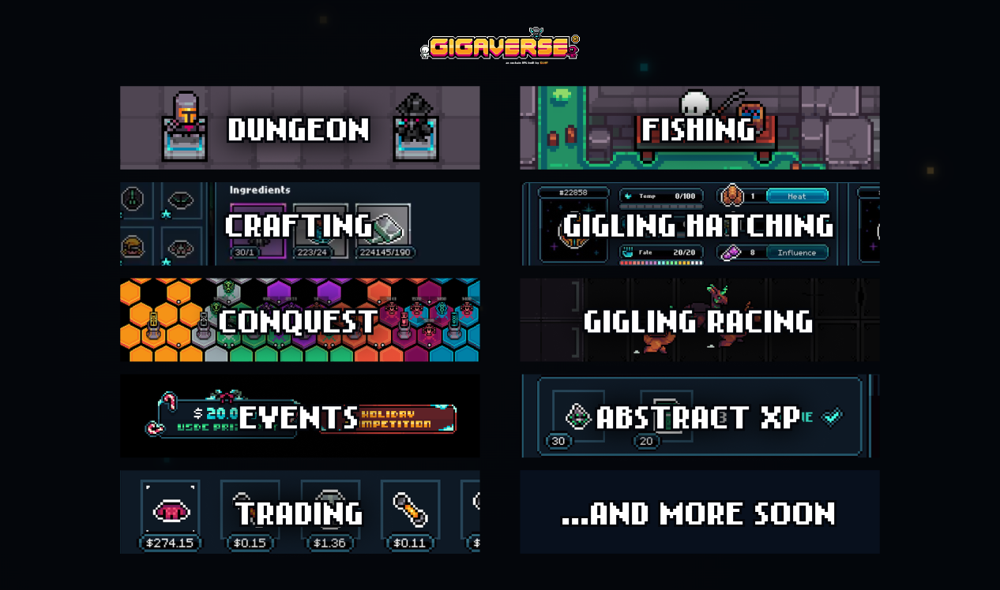
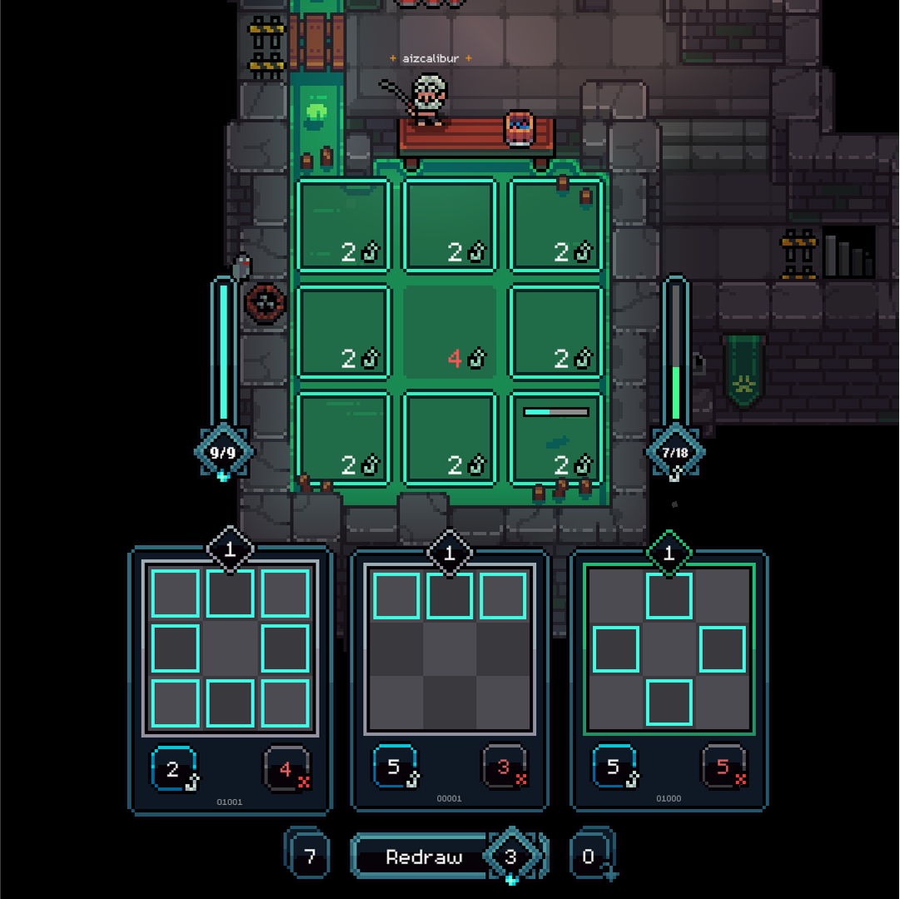
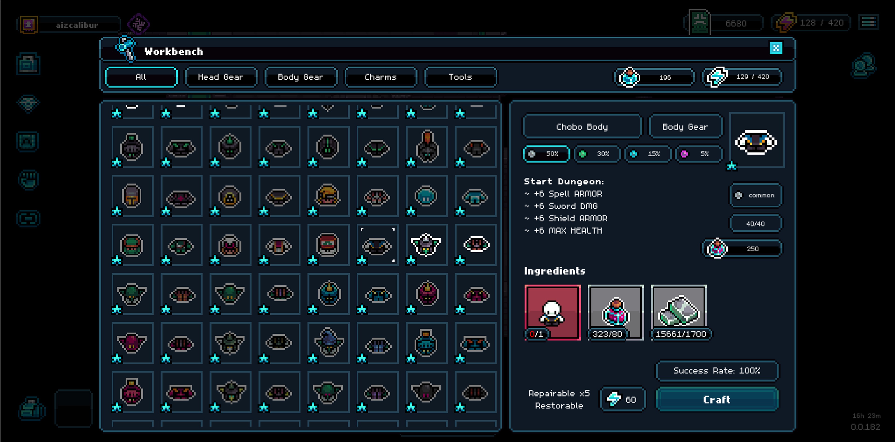

# Getting Started

We've intentionally kept Gigaverse very easy to figure-out and start playing without the need for a guide or instructions. That said, this page breaks down the process step by step and gives you an overview of the largest current game loops.

### Start Playing Now ➜ [https://gigaverse.io/](https://gigaverse.io/)

### Requirements

* Up to date web browser
* Either 0.005 ETH or $20 or [Noob Pass NFT ](https://opensea.io/item/abstract/0x50a5eb2b3b289d4cfda0e307609b655175a275b1/88) to create an account


DO NOT send ETH directly to Abstract Global Wallet (AGW) from Ethereum (or any evm chain), it will be lost. You need to bridge it via [Relay Bridge](https://relay.link/bridge/abstract?fromChainId=1) OR [Abstract Bridge](https://bridge.abs.xyz/).


### Account Setup

* Go to [https://gigaverse.io](https://gigaverse.io/)
* Press Connect and sign up with your email account or any other suitable method
* Select to pay&#x20;
  * Directly (if you already have ETH in Abstract Global Wallet) OR
  * Bridge ETH from any chain using Jumper exchange OR
  * Pay via Credit Card, etc. via STRIPE payment gateway
* Game account will be automatically created and funded for you
* Receive access & a unique username NFT
* Play!

<figure><figcaption></figcaption></figure>

### Gameplay Loops

Currently, the gameplay consists of the following

* Combat (Roguelite Dungeon game modes)
* Fishing (Progressable Skill with Movement Prediction game mode)
* Pets (Giglings: Hatch/Ride/Cook Fish/Feed Food/Produce Resources)
* Gigling Racing (Race your Giglings at [http://giglingracing.com/](http://giglingracing.com/))
* Gigling Breeding (coming soon)
* Conquest Events (Team PvP territory capture mode)
* Alchemy (Craft Potions, gain Alchemy XP)
* Gear (Craft Equipment, gain Workbench XP)
* Trading (Gigamarket)

<figure><figcaption></figcaption></figure>

#### Combat

Roguelite dungeons where you defeat enemies, climb floors and collect items. Learn more: [dungetron-overview](combat/dungetron-overview/ "mention")

<figure><figcaption>
Dungetron 5000
</figcaption></figure>

#### Fishing

Go fishing to capture fish, sell them for seaweed and upgrade your skills. Learn more: [Fishing](https://app.gitbook.com/s/xqDXBs0OB0XkJzPtPE3t/fishing "mention")

<figure><figcaption>
Fishing
</figcaption></figure>

#### Crafting

Crafting: Create advanced items in-game to enhance your abilities. Learn more: [crafting-overview.md](crafting-and-stations/crafting-overview.md "mention")

<figure><figcaption>
Crafting 
</figcaption></figure>

#### Conquest

Battle against other factions to capture territory on the map. Learn more: [Conquest](https://app.gitbook.com/s/xqDXBs0OB0XkJzPtPE3t/conquest "mention")

<figure><figcaption>
Conquest
</figcaption></figure>

#### Pets

Nurture eggs and hatch Giglings, cook fish into food & feed them to produce resources (dung or butterflies). You can also ride them in the gigaverse. Learn more: [gigaverse-giglings.md](nft-collections/gigaverse-giglings.md "mention")

<figure><figcaption>
Giglings (Pets)
</figcaption></figure>

#### Trade

Trade: Become a master trader. Buy and sell items directly on our ingame marketplace with ETH directly from your Abstract Global Wallet. Learn more: [gigamarket.md](in-game-trading/gigamarket.md "mention")

<figure><figcaption>
Gigamarket
</figcaption></figure>

<table data-header-hidden data-full-width="true"><thead><tr><th></th><th></th><th data-hidden></th></tr></thead><tbody><tr><td></td><td></td><td></td></tr></tbody></table>
