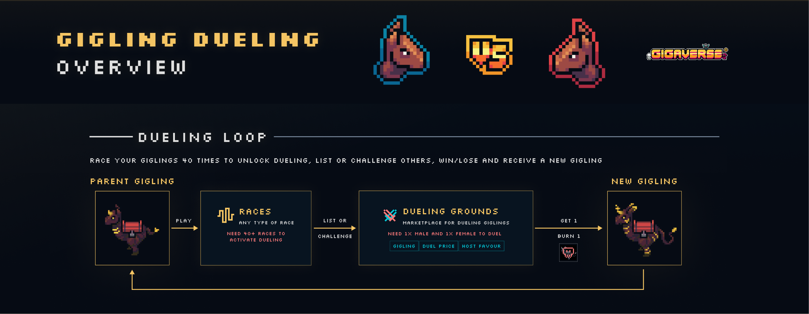
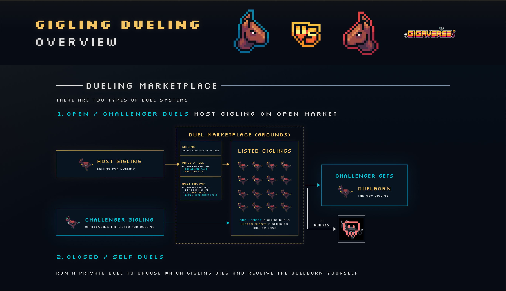

# Gigling Dueling Overview

## Gigling Dueling Overview

Duel your Gigling against another player's gigling or run a private duel against yourself to retire the loser and bring a new Duelborn into your stable.

#### Play now → [giglingracing.com](https://giglingracing.com/)


Dueling is a one-way street for the losing Gigling: whichever Gigling loses a duel is permanently burned. Only duel a Gigling you're prepared to lose.


### Unlocking dueling

A Gigling has to prove itself before it's allowed to duel. Race it, in any type of race, until it reaches **40 total races**, and dueling unlocks for that Gigling.

Once unlocked, you can either **list** it on the Dueling Grounds for others to challenge, or **challenge** another player's listed Gigling yourself.

<figure><figcaption>
Parent Gigling → 40+ races → List or Challenge → Dueling Grounds → New Gigling
</figcaption></figure>


Dueling always needs one male and one female Gigling. Same-gender pairs can't duel each other.


### The Dueling Marketplace

There are two ways to duel.

#### 1. Open / Challenger duels

This is the public marketplace, hosted on the **Dueling Grounds**.

* **Host a Gigling**: List your Gigling for dueling and set two things — a **duel price** (what a challenger pays to duel you) and a **Host Favour** percentage, which skews win odds in your favor. 0% Host Favour mean host dies; 100% means challenger dies.
* **Challenge a Gigling**: Browse listed Giglings on the Grounds and challenge one to a duel.
* Whoever loses the duel is burned. The challenger always receives the **Duelborn**.

<figure><figcaption>
Host Gigling + Challenger Gigling duel on the Grounds; the loser is burned and the winner's side remain and challenger receives the Duelborn.
</figcaption></figure>

#### 2. Closed / Self duels

Run a private duel between two Giglings you already own. This lets you choose exactly which of your own Giglings falls — and you receive the Duelborn either way.

### Duel limits & the Gigling Glue Factory

Every Gigling can duel up to **3 times** in its lifetime. The third duel is final: the Gigling is guaranteed to fall (100%) and its Duelborn arrives.

Want more duels out of a Gigling before that happens? Permanently burning other Giglings produces **Glue**, which can be spent to raise a Gigling's duel limit — up to 3 additional times.

* Faction Giglings, when burned, yield both **Faction Glue** and **Normal Glue**. Non-faction Giglings yield Normal Glue only.
* Raising the duel limit on a Faction Gigling costs both Faction Glue and Normal Glue; non-faction Giglings only need Normal Glue.

| Rarity    | Deglue yield | Reglue cost |
| --------- | ------------ | ----------- |
| Uncommon  | 4            | 4           |
| Rare      | 8            | 4           |
| Epic      | 12           | 6           |
| Legendary | 24           | 6           |
| Relic     | 32           | 8           |
| Giga      | 40           | 8           |


"Deglue yield" is how much Glue you get from permanently burning a Gigling of that rarity. "Reglue cost" is how much Glue it takes to add one extra duel to a Gigling's limit.&#x20;



Deglue results in permanent burning of the gigling nft.


### Attribute inheritance

When a Gigling falls in a duel, its Duelborn inherits five attributes from the two parents: **Faction, Gender, Rarity, Stats,** and **Traits**.


For what each of these attributes actually does on the track, see [Gigling Racing Overview](https://claude.ai/gigling-racing/gigling-racing-overview.md).&#x20;


#### Gender inheritance

The gender of the **fallen** parent passes to the newborn: a male that falls produces a male Duelborn; a female that falls produces a female Duelborn.

#### Faction inheritance

Faction is decided by a 100-point system that both parents contribute to. Whatever's left unclaimed makes the Duelborn factionless.

| Contribution        | Points      |
| ------------------- | ----------- |
| Natural-born parent | 35          |
| Converted parent    | 15          |
| Faction dust        | +5          |
| Unclaimed           | Factionless |

Gigus is a special case: the only way to get a Gigus Duelborn is for the **Gigus parent to be the one that falls**. A Gigus parent that survives the duel doesn't pass on any Gigus points at all — instead, those points get added to the other parent's faction.

A few example outcomes:

| Parent composition             | Faction A | Faction B | Factionless |
| ------------------------------ | --------- | --------- | ----------- |
| Same faction, both natural     | 70%       | –         | 30%         |
| Two factions, both natural     | 35%       | 35%       | 30%         |
| Same faction, natural + 2 dust | 80%       | –         | 20%         |

#### Rarity inheritance

Rarity centers on the **lower-rarity parent** — two parents of the same rarity almost always hold the line.

| Parents               | Uncommon | Rare | Epic | Legendary | Relic | Giga |
| --------------------- | -------- | ---- | ---- | --------- | ----- | ---- |
| Uncommon × Uncommon   | 97%      | 3%   | –    | –         | –     | –    |
| Uncommon × Rare       | 88%      | 12%  | –    | –         | –     | –    |
| Uncommon × Epic       | 75%      | 18%  | 7%   | –         | –     | –    |
| Uncommon × Legendary  | 69%      | 23%  | 9%   | –         | –     | –    |
| Uncommon × Relic      | 62%      | 27%  | 11%  | –         | –     | –    |
| Uncommon × Giga       | 57%      | 30%  | 13%  | –         | –     | –    |
| Rare × Rare           | 4%       | 93%  | 3%   | –         | –     | –    |
| Rare × Epic           | 4%       | 86%  | 10%  | –         | –     | –    |
| Rare × Legendary      | 3%       | 76%  | 15%  | 6%        | –     | –    |
| Rare × Relic          | 3%       | 69%  | 20%  | 8%        | –     | –    |
| Rare × Giga           | 3%       | 64%  | 24%  | 9%        | –     | –    |
| Epic × Epic           | –        | 4%   | 94%  | 2%        | –     | –    |
| Epic × Legendary      | –        | 4%   | 88%  | 8%        | –     | –    |
| Epic × Relic          | –        | 3%   | 79%  | 13%       | 5%    | –    |
| Epic × Giga           | –        | 3%   | 73%  | 17%       | 7%    | –    |
| Legendary × Legendary | –        | –    | 4%   | 94%       | 2%    | –    |
| Legendary × Relic     | –        | –    | 4%   | 89%       | 7%    | –    |
| Legendary × Giga      | –        | –    | 4%   | 82%       | 10%   | 4%   |
| Relic × Relic         | –        | –    | –    | 4%        | 95%   | 1%   |
| Relic × Giga          | –        | –    | –    | 4%        | 91%   | 5%   |
| Giga × Giga           | –        | –    | –    | –         | –     | 100% |

#### Stats inheritance

All four race-phase stats — Start, Speed, Stamina, and Finish — are rolled individually for the Duelborn, each based on the two parents' own ranges for that stat.

The closer the parents' ranges sit to each other, the more predictable the Duelborn's roll. A wide gap between parents produces a wider, less predictable spread; a narrow gap clusters outcomes tightly around the middle.

#### Traits inheritance

Duelborn traits come out of four rolls, in order:

1.  **Rarity of the Duelborn** sets the maximum number of traits it can have:

    | Rarity    | Max traits |
    | --------- | ---------- |
    | Uncommon  | 1          |
    | Rare      | 2          |
    | Epic      | 3          |
    | Legendary | 4          |
    | Relic     | 5          |
    | Giga      | 6          |
2. **Mutation / condition roll** decides whether the Duelborn gets a trait outside the normal pool. There's a **10% chance to mutate**, which grants a Gen Mutation trait. Separately, if a duel condition is met, the Duelborn gets a Conditional trait instead.
3.  **Parent trait roll** fills slots based on the star tier of each parent's own traits. The percentages below are blended ranges, not exact odds for any single duel:

    | Male × Female | ★   | ★★  | ★★★ |
    | ------------- | --- | --- | --- |
    | ★ × ★★        | 67% | 27% | 7%  |
    | ★ × ★★★       | 34% | 51% | 15% |
    | ★ × ★★★★      | 21% | 29% | 50% |
    | ★★ × ★★       | 24% | 59% | 18% |
    | ★★ × ★★★★     | 16% | 40% | 43% |
    | ★★★ × ★★★★    | 12% | 29% | 59% |
4. **Fill roll** covers any slots still open after the parent roll: ★ 67%, ★★ 27%, ★★★ 7%.

### Gigling traits reference

Base trait pool (Tier 1–3, scaling by star rating): **Clutch, Fast Start, Surger, Closer, Comeback, Steady, Volatile, Faction Heart.**

Gen Mutation traits (from the mutation roll): **Dunglover, Sticky Wings.**

Duel Conditional traits (from meeting a duel condition): **Gigus Blessing, First Born.**


Numbers on this page are subject to balance changes.&#x20;

