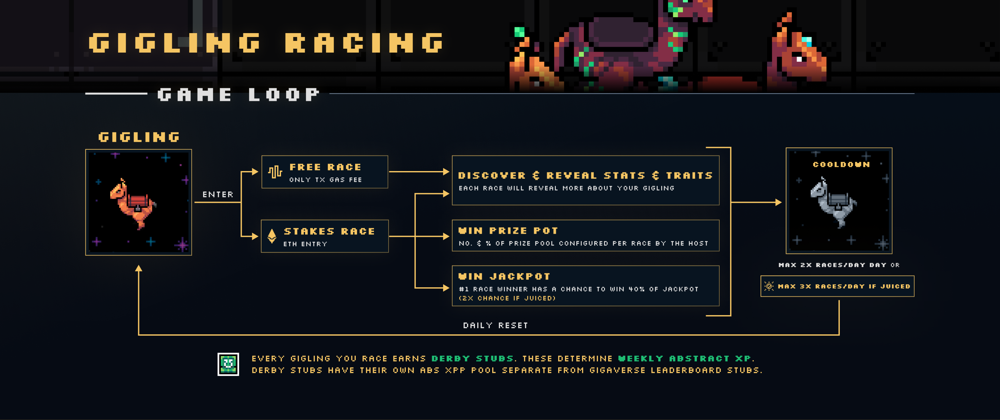
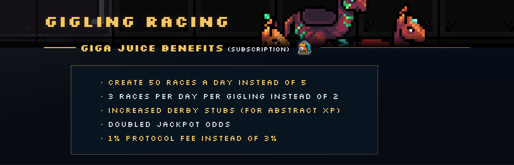
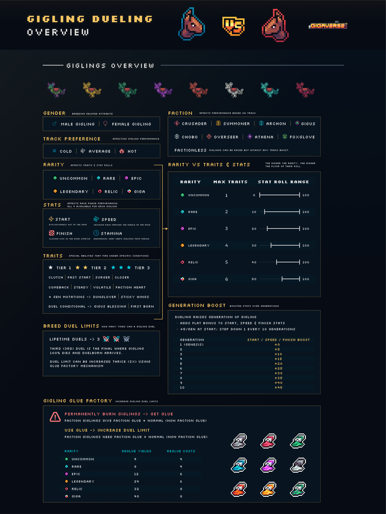
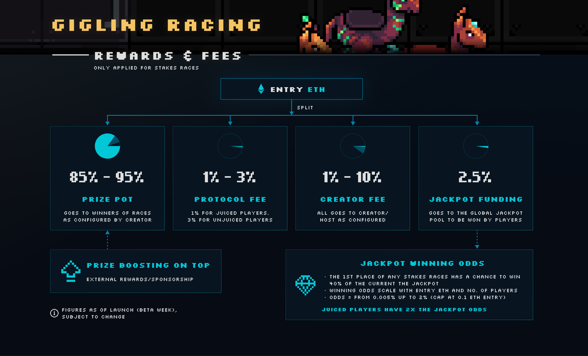
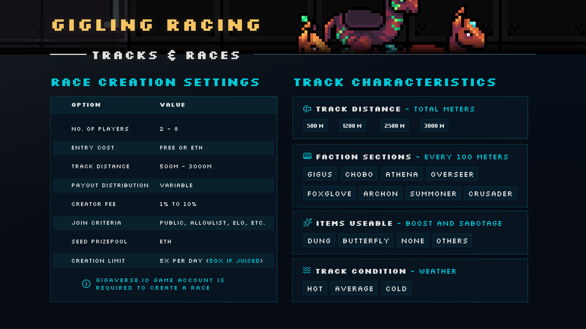

# Gigling Racing Overview

Race your Gigling (a lovable two-legged horse) against other players, onchain, for stakes.

### Play now → [giglingracing.com](https://giglingracing.com)&#x20;


You only need a [Gigling NFT](https://opensea.io/collection/gigaverse-giglings) and don't necessarily need a Gigaverse account to jump in.


## The Racing Game Loop

* Every Gigling can enter a **Free Race** (only a tx gas fee) or a **Stakes Race** (entry paid in ETH).
* You pay in (if it's a stakes race), your Gigling takes one of the open spots, and the field lines up. Each race can have up to 8 Gigling slots.
* During the race, there's room for mischief: players can use items to boost themselves or sabotage others.
* Each race has its own conditions — distance, weather, and which factions get a boosted stretch of track.
* Racing reveals more about your Gigling: stats and traits are gradually discovered the more you race it.
* Once a Gigling has raced, it goes on **cooldown**. Each Gigling can run up to **2 races per day**, or **3 per day** if you're subscribed to Giga Juice. The daily limit resets every day.
* Reward payouts (in ETH, for stakes races) are split among winners or participants and are configurable by the race's host. For example, a host could decide that ETH only pays out to the top three finishers, with the largest cut going to first (60%), then second (30%), then third (10%).

<figure><figcaption></figcaption></figure>


Every Gigling you race earns **Derby Stubs**. These determine your **weekly Abstract XP**. Derby Stubs have their own Abstract XP pool, separate from Gigaverse leaderboard stubs.


### Giga Juice (subscription)

Giga Juice is an optional subscription that boosts what you can do with racing and race creation:

* Create 50 races a day instead of 5.
* Race each Gigling up to 3 times a day instead of 2.
* Earn increased Derby Stubs (for Abstract XP).
* Get doubled jackpot odds on every stakes race.
* Pay a 1% protocol fee instead of 3% on stakes races.

<figure><figcaption></figcaption></figure>

## The Giglings

### What makes a gigling?

Every Gigling has its own racing identity, made up of a handful of underlying qualities.

Four race-phase stats that decide how it performs at different parts of a race:

* **Start**: Explosiveness out of the gate.
* **Speed**: Cruising pace through the middle of the race.
* **Stamina**: Endurance - what keeps a Gigling from fading in long races.
* **Finish**: Closing kick in the home stretch.

Plus a handful of non-numeric attributes:

* **Gender**: Male or female, a female is required for breeding.
* **Rarity**: One of six tiers, from Uncommon up to Giga. Drives how many traits a Gigling has and the floor of its stat rolls.&#x20;
* **Faction**: One of eight. Determines which stretches of the track give the Gigling a home-turf boost.
* **Track-condition preference**: Cold, average, or hot.&#x20;
* **Traits**: Special abilities that fire under specific conditions: a vicious start, a hard closing kick, a knack for shrugging off bad weather. Each trait has a ★ , ★ ★ , or ★ ★ ★ star tier that scales how strong it is.


Except for a gigling's gender, faction, and rarity, everything else is yours to uncover by watching them race.

Race them, take notes and study their performance over time; discovering what your Gigling is good at is part of the game

Their stats & traits will be revealed gradually as you race them, and fully revealed after they are bred, and their offspring replace them.&#x20;


### Gigling rarity

Every Gigling is one of six rarities: Uncommon, Rare, Epic, Legendary, Relic, or Giga. Rarity matters in two ways.

1. **Base roll:** The higher the rarity, the higher the floor of their roll. At the start of every race, each Gigling’s four core stats are rolled fresh, based on their base stats.
2. **Amount of traits**: Rarer Giglings come with more traits: abilities like a strong start out of the gate, a hard closing kick, or a knack for shrugging off bad conditions.&#x20;

<figure><figcaption></figcaption></figure>

### Gigling career & lifespan

Every Gigling has a finite number of races in it.&#x20;

Once they’re spent, they retire and can’t race again.&#x20;

Every race teaches you a little more about their hidden qualities, and by the back half of their career you’ll have learned where they shine and can start picking races to match their strengths.

When a Gigling retires (or, before this time comes), the path forward is to breed them.

The offspring inherits qualities from both parents and steps into the retired parent’s place in your stable.

### Gigling Breeding

Breeding takes one male Gigling and one female. Mechanically, breeding is being designed to keep the overall population of Giglings flat.

Females are rare compared to males, and present an opportunity to their owners depending how they choose to use them.


Gigling Dueling uses a related but separate inheritance system, and is available once a Gigling has raced 40 times. See [Gigling Dueling Overview](gigling-dueling-overview.md).


## The Race & Track

There are several configurations for a race.

* Entry fee
* Prize split
* No. of players
* Items
* Track distance
* Weather
* Factions (only affect odds; not set parameter)&#x20;

### Fees, split and players

Fees only apply to stakes races — free races have no entry fee to split.

Entry ETH for a stakes race is split four ways:

| Share     | Goes to                                                                  |
| --------- | ------------------------------------------------------------------------ |
| 85% – 95% | Prize pot, paid out to winners as configured by the host                 |
| 1% – 3%   | Protocol fee (1% for Giga Juice subscribers, 3% otherwise)               |
| 1% – 10%  | Creator fee, all of which goes to the race's creator/host, as configured |
| 2.5%      | Jackpot funding, added to the global jackpot pool                        |

Race creators can also set how the prize pot is split among winners — for example, the top three finishers could take 60%, 30%, and 10% of the pot, respectively.


Hosts or sponsors can add external rewards on top of the prize pot — prize boosting isn't limited to the entry-fee split above.


<figure><figcaption></figcaption></figure>

#### The Jackpot

The 1st-place finisher of any stakes race has a chance to win **40% of the current jackpot**. Winning odds scale with the entry ETH and number of players in the race — they range from about 0.005% up to 2%, capped at a 0.1 ETH entry. Giga Juice subscribers get double the jackpot odds.


Figures above are as of launch (beta week) and subject to change.


### Use of items

Dung could be used to sabotage (slow down) rivals and butterflies could be used to boost (speed up) your own Gigling.&#x20;

### Track distance

Every race is set to one of four distances by its creator: 500m, 1200m, 2500m, or 3000m. Make sure you select the right Gigling for the race distance, as each Gigling will have its own preferences, based on its stats and traits.

### Weather / Track conditions

Each race rolls one of three track conditions: cold, average, or hot. Each Gigling has a condition they prefer. Match their preference and they’ll pick up a small speed bonus.

### Factions and the track

There are eight factions, and every Gigling either belongs to one, or runs factionless.

The track is split into stretches blessed by different factions roughly every 100 meters; when a Gigling runs through a stretch matching its own faction, it gets a little boost.

<figure><figcaption></figcaption></figure>

Some factions may show up more often than others in a particular race.

Overall, Gigus faction will appear most often (praise be to Gigus).

The mix of faction stretches is unveiled at the start of the race. More track-level dynamics may come into play down the line.

#### Creating a race

Anyone can join a race with just a Gigling, but **creating** a race requires a Gigaverse.io game account.

When you create a race, you configure:

| Setting             | Options                        |
| ------------------- | ------------------------------ |
| No. of players      | 2 – 8                          |
| Entry cost          | Free or ETH                    |
| Track distance      | 500m – 3000m                   |
| Payout distribution | Variable, set by you           |
| Creator fee         | 1% – 10%                       |
| Join criteria       | Public, allowlist, ELO, etc.   |
| Seed prizepool      | ETH                            |
| Creation limit      | 5 races/day (50/day if Juiced) |

<figure><figcaption></figcaption></figure>

## Onchain, by design

Every race plays out onchain, and many actions generate transactions. Every race is resolved by our custom Race Oracle and results are submitted onchain.&#x20;


The Abstract XP attributed to individual players is driven by their Derby Stubs, which are mostly influenced by the number of races and stakes they participate in each week.


## Getting your first Gigling

Giglings are ERC-721s on Abstract and can be bought on OpenSea:

[https://opensea.io/collection/gigaverse-giglings](https://opensea.io/collection/gigaverse-giglings)

Unhatched Giglings (still in egg form) must be hatched within Gigaverse. Check [gigling-egg-hatchery.md](gigling-egg-hatchery.md "mention")for more details.


Numbers on this page are subject to balance changes.

