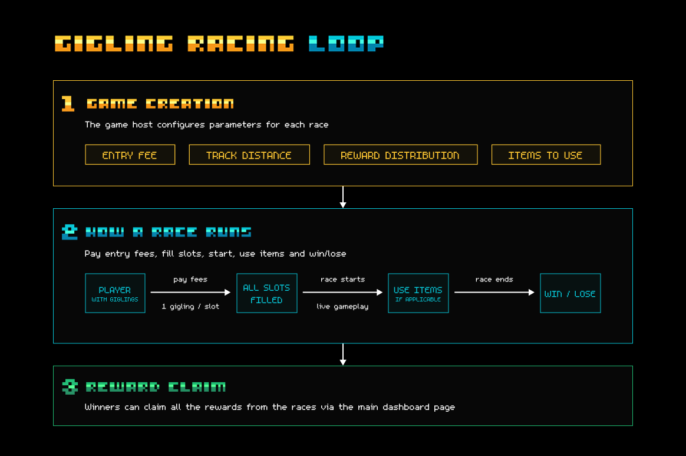
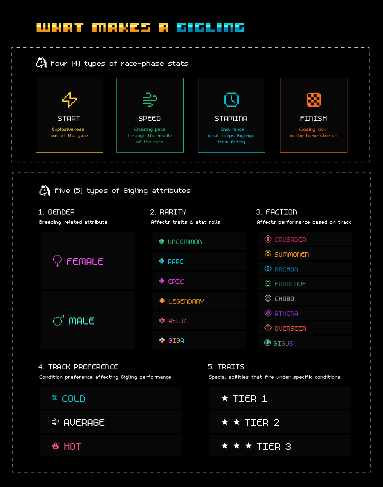
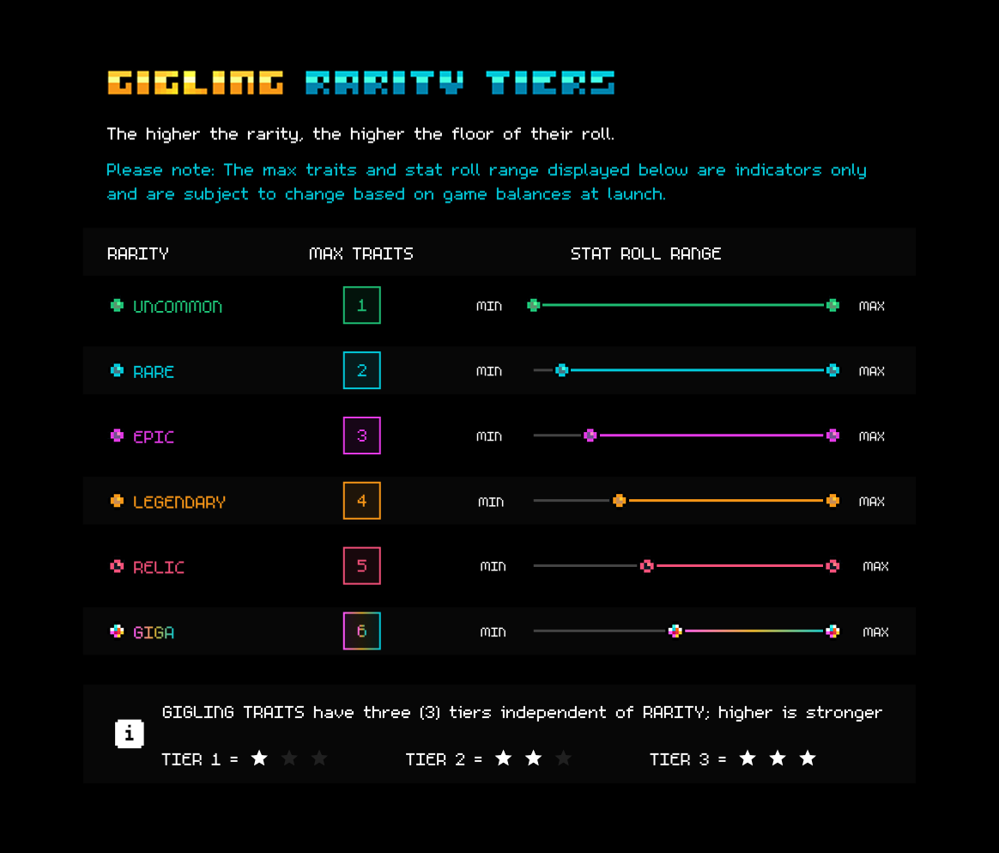

# Gigling Racing Overview

Race your Gigling (a lovable two-legged horse) against other players, onchain, for stakes.

### Play now → [giglingracing.com](https://giglingracing.com)&#x20;


You only need a [Gigling NFT](https://opensea.io/collection/gigaverse-giglings) and don't necessarily need a Gigaverse account to jump in.


## The Racing Game Loop

* Every race has an entry fee in ETH, set by the race creator.
* You pay in, your Gigling takes one of the open spots, and the field lines up.
* Each race can have upto 8 Gigling slots.&#x20;
* During the race, there’s room for mischief; players can use items to boost themselves or sabotage others.
*
  Each race has its own conditions.
* The reward payout (by default ETH) is split among winners or participants and is configurable by the host of the race. For example, the host of a race could decide that ETH will only be paid out to the top three finishers, with the largest cut going to first (60%), then second (30%), then third (10%).

<figure><figcaption></figcaption></figure>

## The Giglings

### What makes a gigling?

Every Gigling has its own racing identity, made up of a handful of underlying qualities.

Four race-phase stats that decide how it performs at different parts of a race:

* **Start**: Explosiveness out of the gate.
* **Speed**: Cruising pace through the middle of the race.
* **Stamina**: Endurance - what keeps a Gigling from fading in long races.
* **Finish**: Closing kick in the home stretch.

Plus a handful of non-numeric attributes:

* **Gender**: Male or female, a female is required for breeding.
* **Rarity**: One of six tiers, from Uncommon up to Giga. Drives how many traits a Gigling has and the floor of its stat rolls.&#x20;
* **Faction**: One of eight. Determines which stretches of the track give the Gigling a home-turf boost.
* **Track-condition preference**: Cold, average, or hot.&#x20;
* **Traits**: Special abilities that fire under specific conditions: a vicious start, a hard closing kick, a knack for shrugging off bad weather. Each trait has a ★ , ★ ★ , or ★ ★ ★ star tier that scales how strong it is.

<figure><figcaption></figcaption></figure>


Except for a gigling's gender, faction, and rarity, everything else is yours to uncover by watching them race.

Race them, take notes and study their performance over time; discovering what your Gigling is good at is part of the game

Their stats & traits will be revealed gradually as you race them, and fully revealed after they are bred, and their offspring replace them.&#x20;


### Gigling rarity

Every Gigling is one of six rarities: Uncommon, Rare, Epic, Legendary, Relic, or Giga. Rarity matters in two ways.

1. **Base roll:** The higher the rarity, the higher the floor of their roll. At the start of every race, each Gigling’s four core stats are rolled fresh, based on their base stats.
2. **Amount of traits**: Rarer Giglings come with more traits: abilities like a strong start out of the gate, a hard closing kick, or a knack for shrugging off bad conditions.&#x20;

<figure><figcaption></figcaption></figure>

### Gigling career & lifespan

Every Gigling has a finite number of races in it.&#x20;

Once they’re spent, they retire and can’t race again.&#x20;

Every race teaches you a little more about their hidden qualities, and by the back half of their career you’ll have learned where they shine and can start picking races to match their strengths.

When a Gigling retires (or, before this time comes), the path forward is to breed them.

The offspring inherits qualities from both parents and steps into the retired parent’s place in your stable.

### Gigling Breeding

Breeding takes one male Gigling and one female. Mechanically, breeding is being designed to keep the overall population of Giglings flat.

Females are rare compared to males, and present an opportunity to their owners depending how they choose to use them.

Breeding will go live soon after Gigling Racing does.

## The Race & Track

There are several configurations for a race.

* Entry fee
* Prize split
* No. of players
* Items
* Track distance
* Weather
* Factions (only affect odds; not set parameter)&#x20;

### Fees, split and players

Race creators can set the entry fee & house fee per race, along with how the prizes are split among the winners. The number of players can be up to 8 per race.&#x20;


Apart from the house fee and prize split, a small % of entry fees is reserved for protocol fee and ongoing jackpot pool.&#x20;


### Use of items

The host picks which items, if any, are in play. For example, dung could be used to sabotage (slow down) rivals and butterflies could be used to boost (speed up) your own Gigling.

### Track distance

Every race has a set distance (# of meters) chosen by the creator of the race. Make sure you select the right Gigling for the race distance, as each Gigling will have its own preferences, based on its stats and traits.

### Weather / Track conditions

Each race rolls one of three track conditions: cold, average, or hot. Each Gigling has a condition they prefer. Match their preference and they’ll pick up a small speed bonus.

### Factions and the track

There are eight factions, and every Gigling either belongs to one, or runs factionless.&#x20;

The track is split into stretches blessed by different factions; when a Gigling runs through a stretch matching its own faction, it gets a little boost.

<figure><figcaption>
Crusader, Overseer, Athena, Archon, Foxglove, Summoner, Chobo, Gigus
</figcaption></figure>



\
Some factions may show up more often than others in a particular race.&#x20;

Overall, Gigus faction will appear most often (praise be to Gigus).&#x20;

The mix of faction stretches is unveiled at the start of the race. More track-level dynamics may come into play down the line.

## Onchain, by design

Every race plays out onchain, and many actions generate transactions. Every race is resolved by our custom Race Oracle and results are submitted onchain.&#x20;


The Abstract XP attributed to individual players will be mostly influenced by the number of races they participate in, each week.


## Getting your first Gigling

Giglings are ERC-721s on Abstract and can be bought on OpenSea:

[https://opensea.io/collection/gigaverse-giglings](https://opensea.io/collection/gigaverse-giglings)

Unhatched Giglings (still in egg form) must be hatched within Gigaverse. Check [gigling-egg-hatchery.md](gigling-egg-hatchery.md "mention")for more details.
