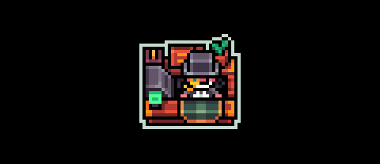

# Gigamarket

<figure><figcaption>
Gigamarket
</figcaption></figure>

The gigamarket is an integrated onchain marketplace / order book to allow for easy item trading between players in gigaverse. Within its first two weeks, gigamarket saw 250,000+ items traded.

It is in essence a one-stop shop to trade all your [gigaverse-game-items.md](../nft-collections/gigaverse-game-items.md "mention").&#x20;

Features:&#x20;

* Gamer friendly & familiar UI
* Filter based on the type of item - Material, Consumable, Skin or Collectible
* Realtime ETH <> USD value indicator&#x20;
* Bulk buy or list&#x20;
* List at floor price
* Abstract Global Wallet session system for ease of trades


[gigus-maximus.md](../lore-and-special-characters/gigus-maximus.md "mention") monitors your trading behaviour on gigamarket.


<figure><figcaption>
UI of gigamarket in game
</figcaption></figure>

When using the gigamarket, be aware:

* It may take some time for items you've purchased to arrive in your inventory.


Hint: Use the Refresh button in your Inventory after any purchases.&#x20;



Warning: If your items disappear after refreshing, wait some time, and hit the refresh inventory button again until you see them.&#x20;


* Items may appear to arrive before they actually do since the front-end sometimes processes sales faster than the gigamarket listings are processed.
* If you are trying to make a purchase and see a transaction error in your Abstract Global Wallet, it's likely someone just purchased the item before you were able to complete your transaction. In this case, open and close the gigamarket tab. If you still get an error, refresh your browser and try again.

<table data-header-hidden data-full-width="true"><thead><tr><th></th><th></th><th data-hidden></th></tr></thead><tbody><tr><td></td><td></td><td></td></tr></tbody></table>
