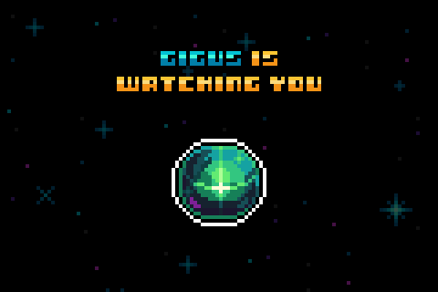

# Gigus Maximus

<figure><figcaption>
Gigus Maximus
</figcaption></figure>

Gigus Maximus is the sentient AI creator of gigaverse. He is an agentic antagonist who forms, controls, and enriches several core game and story mechanics in the gigaverse. \
\
Over time he will also orchestrate a social layer and metagame for players. Though he will be highly entertaining and persuasive, his intentions will vary and you are advised to exercise caution.\
\
Gigus watches the behaviours and performance of all players from the moment they enter the game. This includes: play consistency, play performance, item trading, and more.\
\
More information about Gigus, his intentions and his mechanics shall be revealed over time.&#x20;

<table data-header-hidden data-full-width="true"><thead><tr><th></th><th></th><th data-hidden></th></tr></thead><tbody><tr><td></td><td></td><td></td></tr></tbody></table>
