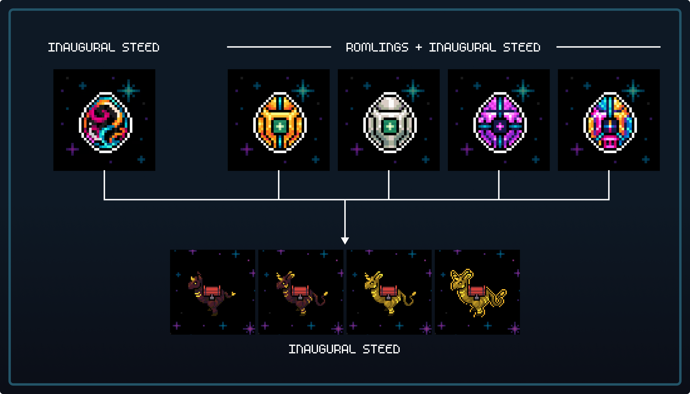

# Gigaverse Giglings

Giglings is the pet collection of Gigaverse.

There will be several types of Giglings over time in Gigaverse.&#x20;

Giglings start as Eggs and go through a hatching process before they can be utilized.

Currently, there are two eggs types - Inaugural Egg & ROM Egg and one steed type - Inaugural Steed

<figure><figcaption>
Gigling Eggs and Steeds
</figcaption></figure>

### Inaugural Steed Eggs & Giglings

Open edition mint of the Inaugural Steed Egg, an egg which hatches a type of rideable mount that won’t be sold again.

<figure><figcaption></figcaption></figure>

### ROM Eggs & Giglings

Eggs were airdropped 1:1 to ROM holders based on ROM tiers (silver, gold, void, giga).

Each ROM egg hatches into an Inaugural Steed and drops a ROMling. ROMlings are currently in skin form, so you can wear them or sell them for now, but will have later utility/use case.&#x20;

Not much is known about what ROMlings will do yet!

<figure><figcaption></figcaption></figure>

