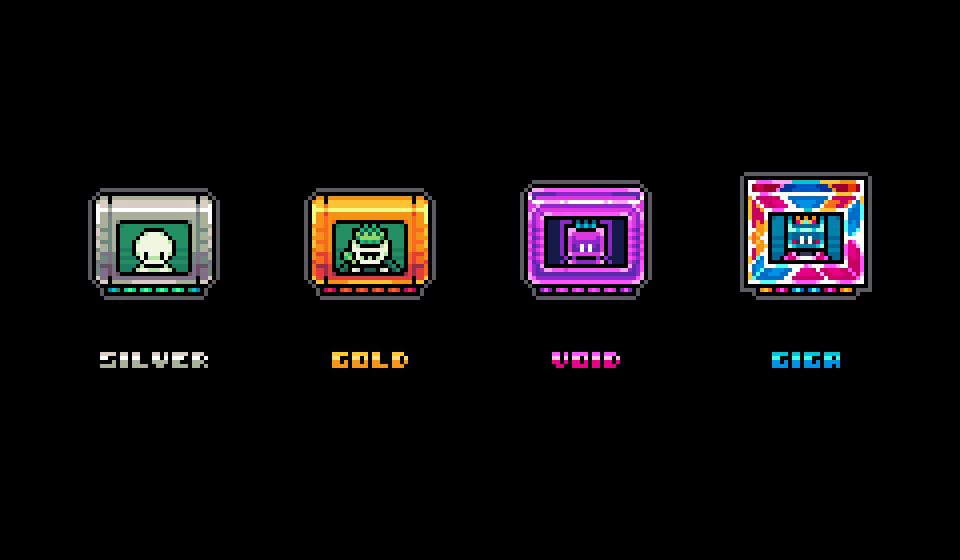

# Gigaverse ROMs

**Gigaverse ROMs** **are the key to unlocking the true power of the Gigaverse.** To learn how we think about ROMs and their future role in our ecosystem, [read this article](https://x.com/0xDith/status/1933170212343288293). 🔍

Each ROM functions as a resource factory within the Gigaverse ecosystem and maximizes your long term alignment with Gigaverse.&#x20;

<figure><figcaption>
Four tiers of Gigaverse ROM
</figcaption></figure>

***

### Initial Utility & Benefits:&#x20;

* Players get more energy to perform more actions
* Generate exclusive resources on an ongoing basis
* Generates [abstract-stubs.md](../abstract-eco/abstract-stubs.md "mention") passively to grant more XP
* Prioritized in future game updates & ecosystem rewards
* Rarity based scaling: Silver, Gold, Void, Giga tiers


Gigus, the sentient AI creator of the gigaverse admires the ROMs.


***

### Token Specifications:

* Blockchain - Abstract
* Type - ERC-721
* Total Supply - 10,000
* Tiers & Supply - Silver (5800), Gold (3200), Void (850), Giga (150)
* Contract - [0x59EEC556cEf447E13eDf4BfD3D4433d8daD8a7a5](https://abscan.org/token/0x59eec556cef447e13edf4bfd3d4433d8dad8a7a5)

***

### Traits:

* Tier: Higher rarity tiers produce more resources
* Faction: Determines the faction resources that you can claim. Learn more here -> [factions.md](../factions/factions.md "mention")
* Memory: Larger memory produces more energy that you can claim
* Serial Number: It has not yet been revealed what serial numbers do
* Stub Boost Level: Higher levels generate higher Abstract Stubs passively. Max level is 60.

***

### In-game Resources:

Note: the output ratio of ROMs may be rebalanced in the future, as they have been in the past. &#x20;

<figure><figcaption></figcaption></figure>

***

### ROM Link & Upgrade:

#### ROM Link

Link ROMs to increase resource production boost by 60% (both energy and materials).

This is stacked with the 20% production boost by [Giga Juice](https://app.gitbook.com/s/xqDXBs0OB0XkJzPtPE3t/giga-juice "mention") resulting in a total of 80% boost.

Only 1:1 ROM linking is possible.

The ROM used to boost another ROM does not produce any resources. Both will still generate Abstract Stubs passively.&#x20;

<figure><figcaption></figcaption></figure>

#### ROM Upgrades&#x20;

ROMs can be upgraded from level 1 to level 60 to increase the passive Abstract Stubs generation up to 600%.

Gigus Dust is used to upgrade ROMs.&#x20;

The energy produced by the ROMs can be converted into Gigus Dust.

<figure><figcaption></figcaption></figure>

***

### Marketplace:

* [OpenSea](https://opensea.io/collection/gigaverse-roms-abstract)&#x20;

<table data-header-hidden data-full-width="true"><thead><tr><th></th><th></th><th data-hidden></th></tr></thead><tbody><tr><td></td><td></td><td></td></tr></tbody></table>
