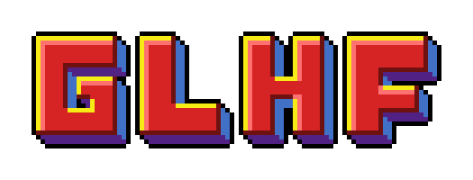

# GLHFers

<figure><figcaption></figcaption></figure>

### Introduction

GLHFers are the genesis PFP collection of GLHF, the game studio building gigaverse. They are a deflationary ERC-721 NFT collection on Ethereum Mainnet and are regarded as "_THE crypto gaming PFP_" by the community. \
\
The collection launched in January 2024 and minted at a price of 0.0369 ETH per NFT. The mint of GLHFers used a novel approach to WL curation — "[programmatic whitelisting](https://fxtwitter.com/0xDith/status/1745571890385793435?s=20)" via the Adjutant bot, which was also built by GLHF.\
\
The original supply of the collection was 3,690 NFTs, with only 3,154 being available via the general mint, and the final 150 tokens reserved as Special Characters (1/1s) to be slowly auctioned over time by the Auctioneer. Learn more about him here: [auctioneer.md](../lore-and-special-characters/auctioneer.md "mention").

### Inspiration

GLHFers is a nostalgia-infused collection inspired by the golden age of gaming: the 1990s. The collection was created by Gigaverse's lead artist, Bunyoo, who paid homage to the games we know & love from our childhoods through the overall style of the collection and character traits.&#x20;

### Special Characters (1/1s)

The GLHFers collection contains a total of 200 Special Characters (1/1s). Their status as Special Characters is reflected in the collection metadata. \
\
When Special Characters are auctioned by the Auctioneer, they are often done so with some sort of unique auction mechanic, or other utility or benefit that he specifies at the time. \
\
The most recent set of auctions, the Masters of the Gigaverse, function as [Skin Factories](https://x.com/playgigaverse/status/1877320766922043888) within Gigaverse, providing the owners of these NFTs with unique skins dripped out to them on a weekly basis. \
\
In the future, a very select, small number of Special Characters will be obtainable as competition prizes & special rewards for elite accomplishments within Gigaverse. \
\
The long term function of the Special Characters and why they exist has not yet been revealed.&#x20;

### Auctions&#x20;

Auctions are carried out on the GLHFers official website ([https://www.glhfers.com/](https://www.glhfers.com/)) and are always announced in advance. There will never be any surprise mints or auctions for the GLHFers collection. \
\
Auctions are announced by the Auctioneer. In the past, they have run for 24 hours and bids are made in ETH. If a bidder is outbid, their ETH is returned to them immediately. \
\
You can see previous auctions [here](https://discord.com/channels/1176535183579689010/1198938241668235316) and the bids that were made on them [here](https://discord.com/channels/1176535183579689010/1198293026099974234).&#x20;

### Deflationary Mechanic&#x20;

The GLHFers collection is deflationary because the Auctioneer uses funds he raises from auctions to sweep & burn the floor of the collection. To date, he has burned 420 GLHFers from the collection, forever removing them from the supply.&#x20;

### Marketplace:

[OpenSea](https://opensea.io/collection/glhfers) (Ethereum)

### Difference between GLHFers and Gigaverse ROMs

Check this [Article](https://twitter.com/0xDith/status/1973814707011379358) by Dith on the differences between our collections

<table data-header-hidden data-full-width="true"><thead><tr><th></th><th></th><th data-hidden></th></tr></thead><tbody><tr><td></td><td></td><td></td></tr></tbody></table>
