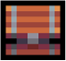

# Chests

Chests contain a variety of items.

Currently, there are two types of Chests - Normal & Juice

###  Normal Chest

:sunglasses: Available for all players (juiced or not juiced).

:map: Bottom of the map, on the right side of the fishing area.

:timer: Can be claimed once per week.&#x20;

:gem: Contains common crafting materials.

<figure><figcaption></figcaption></figure>

###  Juice Chest

:beverage\_box: Available exclusively for Giga Juice enjoyers. Check out [Giga Juice](https://app.gitbook.com/s/xqDXBs0OB0XkJzPtPE3t/giga-juice "mention").

:map: Top of the map, on the left side of the Dungetron area across the bridge.

:timer: Can be claimed once per week.&#x20;

:gem: Contains exclusive charm crafting materials such as Hexchain, Sapphire annd Soulmint.

<figure><figcaption></figcaption></figure>

<table data-header-hidden data-full-width="true"><thead><tr><th></th><th></th><th data-hidden></th></tr></thead><tbody><tr><td></td><td></td><td></td></tr></tbody></table>

