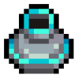
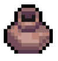

# Pots

Pots contain a variety of utility items.

Currently, there are two types of Pots - <mark style="color:blue;">Blue</mark> and <mark style="color:orange;">Brown</mark>

You need 5 Energy and Hands (crafted in [workbench](../crafting-and-stations/workbench/ "mention")) to break pots.

 <mark style="color:blue;">Blue</mark> pots can be broken with Paper Hands.

May contain: Giga Shards, Dungeon Scrap, Wood, Stone, Glass Orb (Rare)

<figure><figcaption>
Paper Hands
</figcaption></figure>

 <mark style="color:orange;">Brown</mark> pots can be broken with Rock Hands.

May contain: May contain Giga Shards, Dungeon Scrap, Stone, Wood, Bone, Fiber, Blank Tomes, Small or Medium consumables, or Ruby Key (Epic)

<figure><figcaption>
Rock Hands
</figcaption></figure>

<table data-header-hidden data-full-width="true"><thead><tr><th></th><th></th><th data-hidden></th></tr></thead><tbody><tr><td></td><td></td><td></td></tr></tbody></table>
